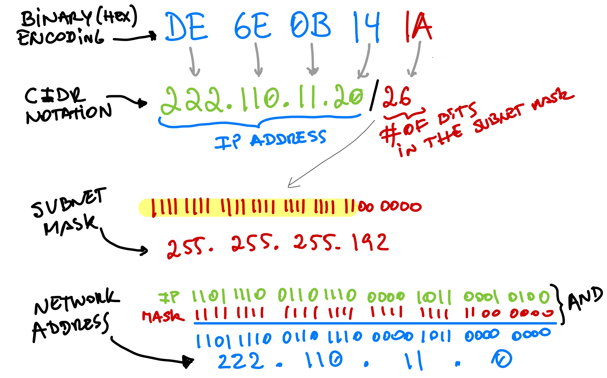
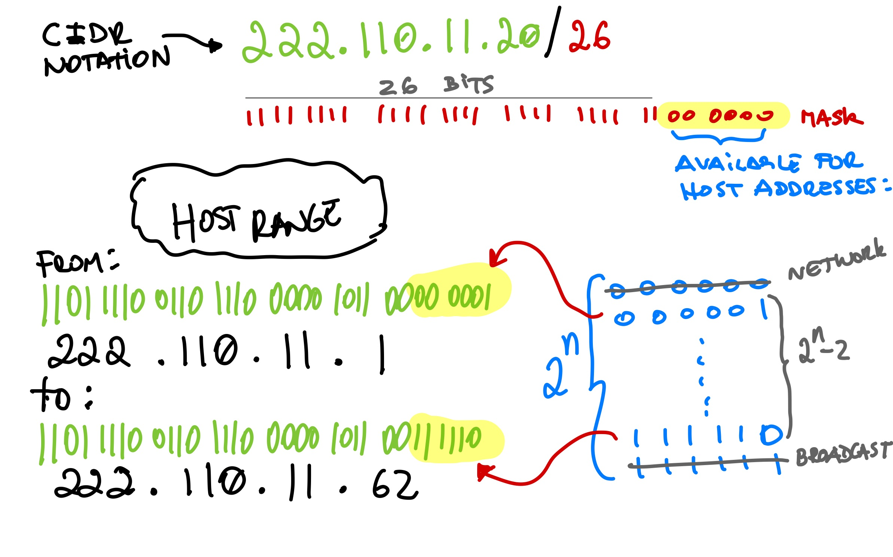

# Homework Assignment 1 (due Feb 9th)

The goal of this assignment is to practice **opening/reading binary files**, **number systems**, and **bitwise operations** in `C`.  The assignment is worth a total of 100 points.  If you have any questions or need any help, please visit us during office hours and/or post questions on `EdStem`.

## `1. HexDump (45 pts)`
This program will open a *binary file* and dump its contents to the *standard output*.  It should work similar to the `hexdump` utility.  You can use the [example code provided with the `fread` documentation](http://www.cplusplus.com/reference/cstdio/fread/) for properly opening a binary file.  Note that the example follows these steps for opening/loading/closing a binary file:

- create two pointers, one for the file and another for the buffer in memory
- open the binary file in `rb` mode
- check if the binary was successfuly opened
- obtain the file size in bytes
- allocate memory dynamically for the buffer
- load the file contents into the buffer
- free the memory dynamically allocated   

> We strongly suggest you to read the documentation of the following functions `fopen/fclose`, `fseek/ftell/rewind`, and `malloc/free`.

### Input
Your program will receive the following command line arguments:
```text
<fname> File name for the binary file
<N>     Number of bytes to show on each row (N>0)
```

The line below shows an example of using your program:
```bash
$ ./hexdump file.bin 16
```

### Output
Your program should write the contents of the binary file to the `stdout` in text form.  On each line your program will show a maximum of `N` bytes using hexadecimal notation.  The first token on each line must be the index of the first byte in that row, using an hexadecimal number of 4 bytes.  Check the example below for more details, assuming the input file contains 20 bytes.

```bash
$ ./hexdump file.bin 16
00000000 cf fa ed fe 07 00 00 01 03 00 00 00 02 00 00 00
00000010 0e 00 00 00
$
$ ./hexdump file.bin 8
00000000 cf fa ed fe 07 00 00 01 
00000008 03 00 00 00 02 00 00 00
00000010 0e 00 00 00
```

## `2. IPv4 Addresses (55 pts)`
In this problem, your program will read a databank of *IP addresses* and their respective *subnet masks*.  The databank is stored as a *binary file* in which every chunk of 5 consecutive bytes represents an IP address and the number of bits in the subnet mask.  The goal of your program is to read the information provided in the databank and display the following information corresponding to each pair of IP address and subnet mask:

- the IP address
- the network address
- the usable IP range for hosts
- the subnet mask

### What is an IP address?
An IP address is a 32-bit number used to uniquely identify a device on a TCP/IP network.   The bitstring can also be expressed in `dotted-decimal` format, with four decimal numbers separated by periods, such as `131.128.81.111`.  In order to translate a bitstring into the corresponding dotted-decimal format, the 32-bit string is divided 4 8-bit sections, known as `octects`, and each of the four octects is converted into a decimal number.  For the IP address provided above the corresponding 32-bit string is `10000011 10000000 01010001 01101111`.

A TCP/IP network can be seen as a collection of networks, and routers that pass data (packets) between networks.  For this reason, IP addresses have two parts, the `network  address` and the `host address`.  Packets are first routed to the destination network, and then delivered to the destination host.

### What is a subnet mask?
A `subnet mask` is another 32-bit number used to split an IP address into network address and host address.  A mask contains a number of consecutive 1s followed by a number of consecutive 0s, and can be expressed in dotted-decimal format.  For example, the mask `11111111 11111111 11111111 00000000` is also `255.255.255.0`.  This mask indicates that the first 24 bits should be use for the network address, and the remaining 8 bits for the host address.  By applying bitwise operations between the subnet mask and the ip address, routers (and applications) are able to extract the network address and the host address from IP addresses.

> *CIDR notation* is a compact representation of an IP address and its associated network mask.  In this notation, an IP address is followed by a slash (`'/'`) character, and a decimal number.  The decimal number is the count of leading 1 bits in the subnet mask.  For example, `131.128.81.111/24` is a compact representation of the IP address and subnet mask provided above.

The illustration below shows a detailed example with a different IP address.  Note that the `binary encoding` in the figure is the representation used to store IP addresses in the binary databank:



The following figure shows a detailed example on how to calculate the range of available host addresses in the network, given an IP address and a subnet mask.  Note that the first and last addresses of the available range are not considered valid host addresses as they are reserved as `network address` and `broadcast address`. 



> When working on this assignment you might find useful a tool that can give you the correct calculations.  Feel free to refer to this [IP subnet calculator](https://www.calculator.net/ip-subnet-calculator.html).

### Input
Your program will receive the following command line arguments:
```text
<fname> File name for the binary file
```

The line below shows an example of using your program:
```bash
$ ./decode-ipv4 file.bin
```

### Output
Your program should send output to the `stdout` in text form.  For each consecutive 5 bytes in the binary file, you will print the corresponding IP/Subnet information.  Each chunk of 5 bytes represents an IP (4 bytes) followed by the number of 1s in the subnet mask (1 byte).  Check the example below for more details, assuming the input file contains 15 bytes.

```bash
$ ./decode-ipv4 file.bin
IP address:      222.110.11.20
Network address: 222.110.11.0
Usable IP range: 222.110.11.1 - 222.110.11.62
Subnet mask:     255.255.255.192

IP address:      148.31.27.2
Network address: 148.31.27.0
Usable IP range: 148.31.27.1 - 148.31.27.254
Subnet mask:     255.255.255.0

IP address:      32.10.10.1
Network address: 32.8.0.0
Usable IP range: 32.8.0.1 - 32.11.255.254
Subnet mask:     255.252.0.0
```

## Submission and Grading
You will submit two files named `hexdump.c` and `decode-ipv4.c`.  Each file/program should include its own `main` function.  You are required to provide meaningful comments in all your functions and use proper coding style and indentation.  Your submission will be tested and graded by an autograder using `gcc` on a `linux` machine, for this reason it cannot be stressed enough that your program must follow the exact specifications for input and output upon submission, including the number of whitespaces.

For each of the questions you either pass the test cases (full points) or not (zero points).  To submit your solution to Gradescope, simply select and upload the two required files.

> :heavy_exclamation_mark: You must be reminded that students caught cheating or plagiarizing will receive `no credit`. Additional actions, including a failing grade in the class or referring the case for disciplinary action, may also be taken.
